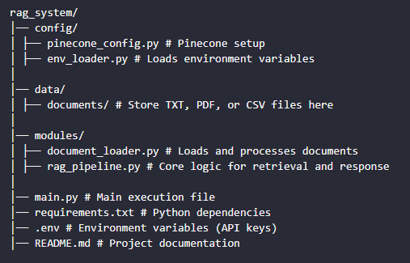

# 📚 RAG System - Retrieval-Augmented Generation with OpenAI & Pinecone

This project implements a **Retrieval-Augmented Generation (RAG) system** using **OpenAI's GPT-4, Pinecone for vector storage, and LangChain** for seamless document retrieval and query processing.

## 🚀 Features
- ✅ **Document Processing**: Supports **TXT, PDF, and CSV** files.
- ✅ **Embeddings with OpenAI**: Converts text into vector embeddings.
- ✅ **Efficient Search**: Uses **Pinecone** to store and retrieve relevant information.
- ✅ **Modular Architecture**: Well-structured codebase for easy scalability and maintenance.
- ✅ **Logging & Error Handling**: Helps identify issues efficiently.

---

## 🏗️ Project Structure



---

## 🔧 Installation & Setup

### 1️⃣ Clone the Repository
```sh
git clone https://github.com/patrick-cuppi/rag-system
cd rag_system
```

### 2️⃣ Install Dependencies
```sh
pip install -r requirements.txt
```
### 3️⃣ Configure Environment Variables
Create a .env file in the root directory and add the following:
```bash
OPENAI_API_KEY=your_openai_api_key
PINECONE_API_KEY=your_pinecone_api_key
PINECONE_ENV=your_pinecone_environment
PINECONE_INDEX=your_pinecone_index_name
```

### 📥 Adding Documents
Place your TXT, PDF, or CSV files inside the data/documents/folder.

### 🏃 Running the RAG System
```sh
python main.py
```
You'll be prompted to enter a question based on the stored documents.

### 💡 How It Works
Loads Documents → Extracts text from supported formats.

Embeds the Content → Converts documents into vector representations using OpenAI.

Stores in Pinecone → Enables fast and efficient retrieval.

Retrieves & Generates Answers → Finds relevant information and uses GPT-4 to generate a response.

### ✨ Example Usage
```sh
Enter your question (or type 'exit' to quit): What is the main topic of the document?
```
🔹 Response: "The document discusses advanced machine learning techniques for image processing."

### 🛠️ Troubleshooting
If you encounter any issues:

Ensure API keys are correct in .env.

Verify Pinecone index exists.

Run pip install -r requirements.txt to reinstall dependencies.

Check logs in rag_pipeline.py for detailed errors.

### 📜 License
This project is licensed under the MIT License.

### 🤝 Contributions
Pull requests and improvements are welcome! Feel free to submit issues or enhancements.