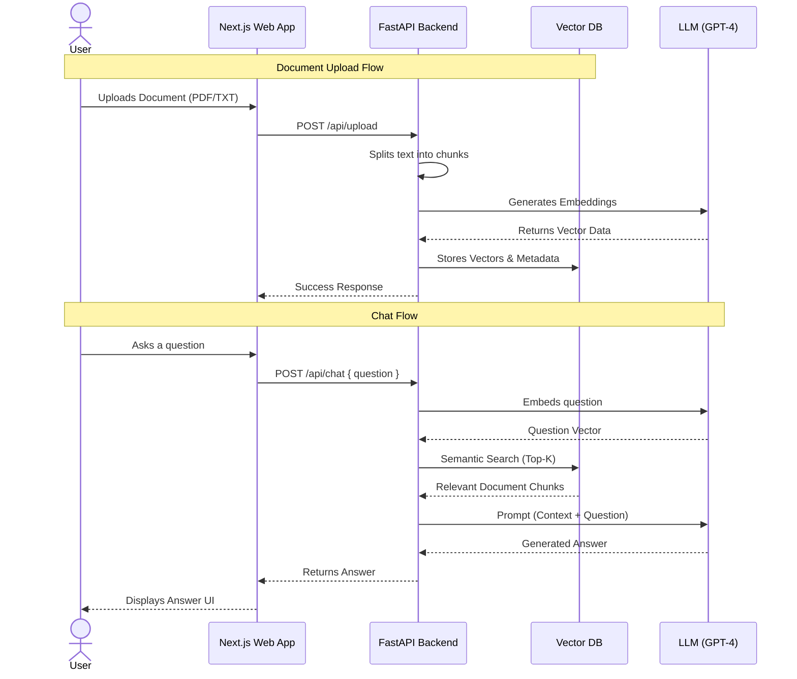

# 🌟 Ask me - Real-world Knowledge System

Ask me is a fullstack **Retrieval-Augmented Generation (RAG)** application designed to solve the problem of extracting accurate, context-aware information from large, unstructured document bases. 

Instead of searching through endless pages of PDFs, TXTs, or CSVs manually, Ask me allows you to instantly "chat" with your documents. It intelligently retrieves the most relevant paragraphs and uses OpenAI's models to generate precise, conversational answers.

## 🖼️ Interface Preview


## 🎯 What problem does it solve?
In the era of information overload, businesses and individuals spend countless hours searching for specific answers within dense documents. Traditional keyword search is limited and often misses semantic context. 

Ask me solves this by:
1. **Understanding Context:** Using vector embeddings to understand the *meaning* behind your question, not just the keywords.
2. **Eliminating Hallucinations:** Grounding the AI's responses exclusively in the documents you provide.
3. **Boosting Productivity:** Turning static files into an interactive, conversational database.

---

## 🏗️ Architecture & Technologies

The project follows a **Clean Architecture** approach, separating the user interface from the business logic and vector processing.

### Tech Stack
- **Frontend:** Next.js (React 18), Tailwind CSS, Lucide Icons
- **Backend:** FastAPI, Python 3.12
- **AI & Processing:** LangChain, OpenAI (GPT-4 & Embeddings)
- **Vector Database:** Pinecone

### 🧠 How it Works


```mermaid
sequenceDiagram
    actor User
    participant Frontend as Next.js Web App
    participant API as FastAPI Backend
    participant Pinecone as Vector DB
    participant OpenAI as LLM (GPT-4)

    %% Upload Flow
    Note over User, Pinecone: Document Upload Flow
    User->>Frontend: Uploads Document (PDF/TXT)
    Frontend->>API: POST /api/upload
    API->>API: Splits text into chunks
    API->>OpenAI: Generates Embeddings
    OpenAI-->>API: Returns Vector Data
    API->>Pinecone: Stores Vectors & Metadata
    API-->>Frontend: Success Response

    %% Chat Flow
    Note over User, OpenAI: Chat Flow
    User->>Frontend: Asks a question
    Frontend->>API: POST /api/chat { question }
    API->>OpenAI: Embeds question
    OpenAI-->>API: Question Vector
    API->>Pinecone: Semantic Search (Top-K)
    Pinecone-->>API: Relevant Document Chunks
    API->>OpenAI: Prompt (Context + Question)
    OpenAI-->>API: Generated Answer
    API-->>Frontend: Returns Answer
    Frontend-->>User: Displays Answer UI
```

---

## 📂 Project Structure

```text
rag-system/
├── backend/                  # Python API
│   ├── app/
│   │   ├── api/routes.py     # FastAPI endpoints
│   │   ├── core/config.py    # Environment validation
│   │   ├── services/         # Business Logic (RAG & Documents)
│   │   └── main.py           # API Entrypoint
│   ├── requirements.txt      # Python dependencies
│   └── .env                  # Backend secrets
├── frontend/                 # Next.js Web Application
│   ├── src/
│   │   ├── app/page.tsx      # Main layout
│   │   ├── components/       # ChatArea, Sidebar
│   │   └── services/api.ts   # API connection logic
│   └── package.json
└── README.md
```

---

## 🚀 Installation & Setup

### 1️⃣ Backend Setup (FastAPI)
The backend handles the AI logic and document processing.

1. Navigate to the backend directory:
   ```sh
   cd backend
   ```
2. Create and activate a virtual environment:
   ```sh
   python3 -m venv .venv
   source .venv/bin/activate  # On Windows use: .venv\Scripts\activate
   ```
3. Install dependencies:
   ```sh
   pip install -r requirements.txt
   ```
4. Configure Environment Variables:
   Create a `.env` file inside the `backend/` folder:
   ```env
   OPENAI_API_KEY=your_openai_api_key
   PINECONE_API_KEY=your_pinecone_api_key
   PINECONE_INDEX=your_pinecone_index_name
   ```
5. Start the API Server:
   ```sh
   uvicorn app.main:app --reload
   ```
   *The API will be available at http://localhost:8000. You can view the Swagger UI at http://localhost:8000/docs.*

### 2️⃣ Frontend Setup (Next.js)
The frontend provides a premium, interactive web interface.

1. Open a new terminal and navigate to the frontend directory:
   ```sh
   cd frontend
   ```
2. Install dependencies:
   ```sh
   npm install
   ```
3. Start the Development Server:
   ```sh
   npm run dev
   ```
   *The Web App will be available at http://localhost:3000.*

---

## 💡 Usage Guide

1. **Upload Documents:** Open the Web App (localhost:3000) and use the left sidebar to upload your `.txt`, `.pdf`, or `.csv` files.
2. **Processing:** The backend will automatically split the documents into manageable chunks, generate embeddings, and store them in Pinecone.
3. **Chat:** Use the chat interface to ask questions. The system will retrieve the most relevant chunks from Pinecone and use GPT-4 to formulate a precise answer based **only** on your documents.
4. **Memory:** The conversation uses `ConversationalRetrievalChain`, meaning the AI remembers context from earlier in your current chat session!

---
*Developed with Clean Architecture principles for maximum scalability.*