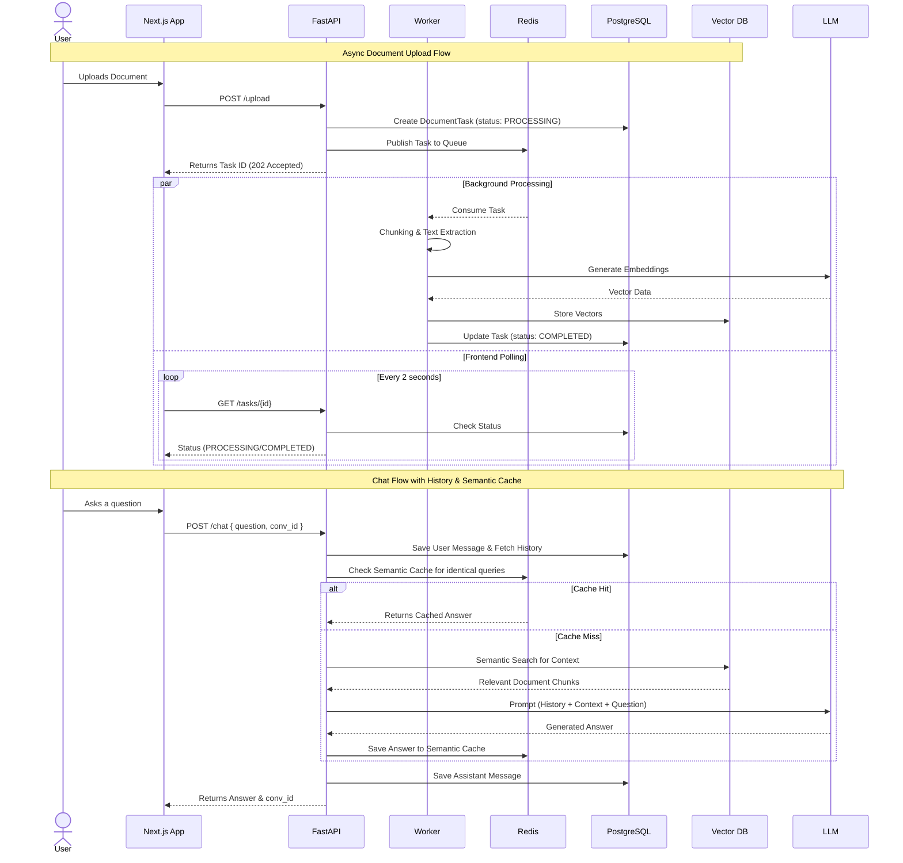
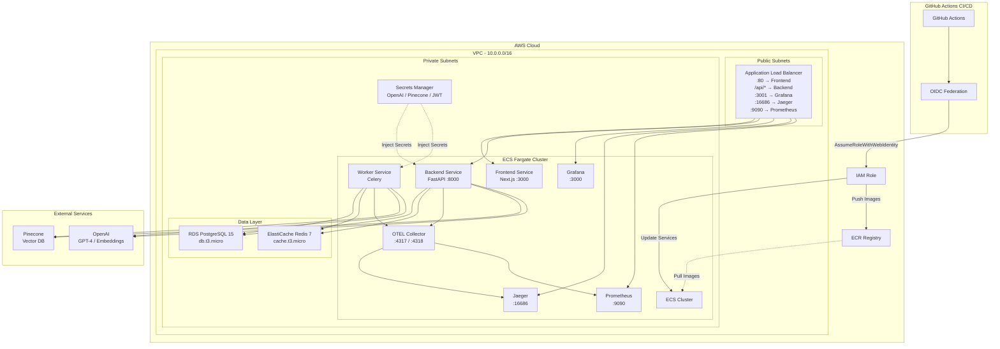

# 🌟 Ask me - Real-world Knowledge System

Ask me is a fullstack **Retrieval-Augmented Generation (RAG)** application designed to solve the problem of extracting accurate, context-aware information from large, unstructured document bases. 

Instead of searching through endless pages of PDFs, TXTs, or CSVs manually, Ask me allows you to instantly "chat" with your documents. It intelligently retrieves the most relevant paragraphs and uses OpenAI's models to generate precise, conversational answers.

## 🎯 What problem does it solve?
In the era of information overload, businesses and individuals spend countless hours searching for specific answers within dense documents. Traditional keyword search is limited and often misses semantic context. 

Ask me solves this by:
1. **Understanding Context:** Using vector embeddings to understand the *meaning* behind your question, not just the keywords.
2. **Eliminating Hallucinations:** Grounding the AI's responses exclusively in the documents you provide.
3. **Boosting Productivity:** Turning static files into an interactive, conversational database.
4. **Ensuring Security:** Utilizing JWT-based authentication to protect user sessions and data access.

---

## 🏗️ Architecture & Technologies

The project follows a **Clean Architecture** approach, separating the user interface from the business logic and vector processing.

### Tech Stack
- **Frontend:** Next.js (React 18), Tailwind CSS, Lucide Icons, js-cookie
- **Backend:** FastAPI, Python 3.12, SQLAlchemy, bcrypt, python-jose
- **Database:** PostgreSQL (for User Data, Chat History, & Task tracking)
- **Message Broker & Cache:** Redis
- **Background Jobs:** Celery
- **AI & Processing:** LangChain, OpenAI (GPT-4 & Embeddings)
- **Vector Database:** Pinecone
- **Observability:** OpenTelemetry, Prometheus, Grafana, Jaeger
- **Cloud Infrastructure:** AWS (ECS Fargate, RDS, ElastiCache, ALB, ECR, Secrets Manager)
- **Infrastructure as Code:** Terraform (modular, S3 remote state)
- **CI/CD:** GitHub Actions (OIDC authentication, zero static credentials)
- **Containerization:** Docker & Docker Compose
- **Testing:** Pytest (Backend), Jest & React Testing Library (Frontend)

### 🧠 How it Works


```mermaid
sequenceDiagram
    actor User
    participant Frontend as Next.js App
    participant API as FastAPI
    participant Celery as Worker
    participant Redis
    participant DB as PostgreSQL
    participant Pinecone as Vector DB
    participant OpenAI as LLM

    %% Upload Flow (Async)
    Note over User, Pinecone: Async Document Upload Flow
    User->>Frontend: Uploads Document
    Frontend->>API: POST /upload
    API->>DB: Create DocumentTask (status: PROCESSING)
    API->>Redis: Publish Task to Queue
    API-->>Frontend: Returns Task ID (202 Accepted)
    
    par Background Processing
        Redis-->>Celery: Consume Task
        Celery->>Celery: Chunking & Text Extraction
        Celery->>OpenAI: Generate Embeddings
        OpenAI-->>Celery: Vector Data
        Celery->>Pinecone: Store Vectors
        Celery->>DB: Update Task (status: COMPLETED)
    and Frontend Polling
        loop Every 2 seconds
            Frontend->>API: GET /tasks/{id}
            API->>DB: Check Status
            API-->>Frontend: Status (PROCESSING/COMPLETED)
        end
    end

    %% Chat Flow with Semantic Cache
    Note over User, OpenAI: Chat Flow with History & Semantic Cache
    User->>Frontend: Asks a question
    Frontend->>API: POST /chat { question, conv_id }
    API->>DB: Save User Message & Fetch History
    
    API->>Redis: Check Semantic Cache for identical queries
    alt Cache Hit
        Redis-->>API: Returns Cached Answer
    else Cache Miss
        API->>Pinecone: Semantic Search for Context
        Pinecone-->>API: Relevant Document Chunks
        API->>OpenAI: Prompt (History + Context + Question)
        OpenAI-->>API: Generated Answer
        API->>Redis: Save Answer to Semantic Cache
    end
    
    API->>DB: Save Assistant Message
    API-->>Frontend: Returns Answer & conv_id
```

---

## ☁️ Cloud Architecture (AWS)

The application is deployed to **AWS** using a fully automated infrastructure provisioned with **Terraform** and deployed via **GitHub Actions** with **OIDC** authentication (zero static credentials).


```mermaid
graph TB
    subgraph "GitHub Actions CI/CD"
        GH["GitHub Actions"]
        OIDC["OIDC Federation"]
        GH --> OIDC
    end

    subgraph "AWS Cloud"
        OIDC -->|"AssumeRoleWithWebIdentity"| IAM["IAM Role"]
        IAM -->|"Push Images"| ECR["ECR Registry"]
        IAM -->|"Update Services"| CLUSTER

        subgraph "VPC - 10.0.0.0/16"
            subgraph "Public Subnets"
                ALB["Application Load Balancer
                :80 → Frontend
                /api/* → Backend
                :3001 → Grafana
                :16686 → Jaeger
                :9090 → Prometheus"]
            end

            subgraph "Private Subnets"
                subgraph "ECS Fargate Cluster" 
                    CLUSTER["ECS Cluster"]
                    FE["Frontend Service
                    Next.js :3000"]
                    BE["Backend Service
                    FastAPI :8000"]
                    WK["Worker Service
                    Celery"]
                    OTEL["OTEL Collector
                    :4317 / :4318"]
                    JAEGER["Jaeger
                    :16686"]
                    PROM["Prometheus
                    :9090"]
                    GRAF["Grafana
                    :3000"]
                end

                subgraph "Data Layer"
                    RDS["RDS PostgreSQL 15
                    db.t3.micro"]
                    REDIS["ElastiCache Redis 7
                    cache.t3.micro"]
                end

                SM["Secrets Manager
                OpenAI / Pinecone / JWT"]
            end
        end
    end

    subgraph "External Services"
        PINECONE["Pinecone
        Vector DB"]
        OPENAI["OpenAI
        GPT-4 / Embeddings"]
    end

    ALB --> FE
    ALB --> BE
    ALB --> GRAF
    ALB --> JAEGER
    ALB --> PROM
    BE --> RDS
    BE --> REDIS
    BE --> OTEL
    WK --> RDS
    WK --> REDIS
    WK --> OTEL
    OTEL --> JAEGER
    OTEL --> PROM
    BE --> PINECONE
    BE --> OPENAI
    WK --> PINECONE
    WK --> OPENAI
    SM -.->|"Inject Secrets"| BE
    SM -.->|"Inject Secrets"| WK
    ECR -.->|"Pull Images"| CLUSTER

    classDef aws fill:#FF9900,stroke:#232F3E,color:#232F3E
    classDef external fill:#6366F1,stroke:#4338CA,color:#FFF
    classDef github fill:#24292E,stroke:#1B1F23,color:#FFF
```

### Terraform Modules

| Module | Resources |
|--------|-----------|
| **networking** | VPC, 2 public + 2 private subnets (multi-AZ), Internet Gateway, NAT Gateway, Security Groups |
| **ecr** | 4 container registries (backend, frontend, otel-collector, prometheus) with lifecycle policies |
| **ecs** | ECS Fargate Cluster, 7 task definitions, 7 services, ALB with path-based routing, Cloud Map service discovery, CloudWatch Logs |
| **database** | RDS PostgreSQL 15 (encrypted, automated backups) |
| **cache** | ElastiCache Redis 7.1 |
| **secrets** | AWS Secrets Manager (OpenAI, Pinecone, JWT keys) |

### CI/CD Pipeline

| Workflow | Trigger | Jobs |
|----------|---------|------|
| **CI** (`ci.yml`) | PRs & pushes to `main` | Backend tests (Pytest + Postgres), Frontend (lint + test + build), Terraform validate |
| **Deploy** (`deploy.yml`) | Push to `main` | Build & push images to ECR → Update ECS services (OIDC auth, zero secrets) |
| **Release** (`release.yml`) | Push to `main` | Semantic versioning & changelog generation |

---

## 📂 Project Structure

```text
rag-system/
├── backend/                  # Python API
│   ├── app/
│   │   ├── api/          # FastAPI endpoints & Auth
│   │   ├── core/         # Security (JWT, bcrypt) & Config
│   │   ├── db/           # SQLAlchemy Models & Connection
│   │   ├── services/     # Business Logic (RAG & Documents)
│   │   ├── worker/       # Celery Tasks & App Config
│   │   └── main.py       # API Entrypoint
│   ├── tests/            # Pytest test suite
│   ├── requirements.txt  # Python dependencies
│   ├── Dockerfile        # Backend Container
│   └── .env              # Backend secrets
├── frontend/                 # Next.js Web Application
│   ├── src/
│   │   ├── app/          # Next.js App Router (login, register, home)
│   │   ├── components/   # ChatArea, Sidebar
│   │   └── services/     # API connection & Cookie logic
│   ├── __tests__/        # Jest test suite
│   ├── package.json
│   └── Dockerfile        # Frontend Container (Multi-stage build)
├── terraform/                # Infrastructure as Code (AWS)
│   ├── main.tf           # Provider, modules, Route 53
│   ├── variables.tf      # Input variables
│   ├── outputs.tf        # Resource URLs & ARNs
│   ├── oidc.tf           # GitHub OIDC Provider + IAM Role
│   └── modules/
│       ├── networking/   # VPC, Subnets, Security Groups
│       ├── ecr/          # Container Registries
│       ├── ecs/          # Cluster, ALB, Services, IAM
│       ├── database/     # RDS PostgreSQL
│       ├── cache/        # ElastiCache Redis
│       └── secrets/      # AWS Secrets Manager
├── observability/            # Monitoring & Tracing Config
│   ├── otel-collector-config.yaml  # OTel Collector pipeline
│   ├── otel-collector/             # ECS-ready OTEL Collector image
│   ├── prometheus.yml              # Prometheus scrape targets
│   └── prometheus/                 # ECS-ready Prometheus image
├── .github/workflows/        # CI/CD Pipelines
│   ├── ci.yml            # Continuous Integration
│   ├── deploy.yml        # Continuous Deployment (OIDC)
│   └── release.yml       # Semantic Release
├── docker-compose.yml        # Local Development Orchestration
└── README.md
```

---

## 🚀 Installation & Setup

### Local Development (Docker Compose)

The easiest way to run this project locally is using **Docker Compose**.

#### 1️⃣ Configure Environment Variables

Create a `.env` file in the `backend/` directory:
```env
OPENAI_API_KEY=your_openai_api_key
PINECONE_API_KEY=your_pinecone_api_key
PINECONE_INDEX=your_pinecone_index_name
JWT_SECRET_KEY=generate_a_strong_random_secret_here
REDIS_URL=url_of_your_redis
```
*(Note: `DATABASE_URL` is automatically injected via docker-compose)*

#### 2️⃣ Run the Containers

At the root of the project, simply run:
```bash
docker compose up -d --build
```

#### 3️⃣ Access the Services
- **Web Interface:** http://localhost:3000
- **API Swagger Documentation:** http://localhost:8000/docs
- **Grafana Dashboard:** http://localhost:3001 (login: `admin` / `admin`)
- **Prometheus Metrics:** http://localhost:9090
- **Jaeger Tracing UI:** http://localhost:16686
- **PostgreSQL Database:** Running internally on port `5432`

### AWS Deployment (Terraform)

#### 1️⃣ Bootstrap Remote State
```bash
bash scripts/bootstrap-tfstate.sh
```
This creates the S3 bucket (versioned + encrypted) and DynamoDB table for Terraform state locking.

#### 2️⃣ Configure & Apply
```bash
cd terraform
cp terraform.tfvars.example terraform.tfvars
# Edit terraform.tfvars with your actual values
terraform init
terraform plan
terraform apply
```

#### 3️⃣ Configure GitHub Secrets
After `terraform apply`, set these GitHub repository secrets:
- `AWS_ROLE_ARN` — from Terraform output `github_actions_role_arn`
- `API_URL` — from Terraform output `alb_url` + `/api`

#### 4️⃣ Deploy
Push to `main` branch → GitHub Actions will automatically build, push, and deploy! 🚀

---

## 💡 Usage Guide

1. **Sign Up:** Access `localhost:3000` and create your account.
2. **Log In:** The system uses secure HTTP cookies to persist your session.
3. **Upload Documents:** Use the left sidebar to upload your `.txt`, `.pdf`, or `.csv` files.
4. **Processing:** The backend will automatically split the documents into manageable chunks, generate embeddings, and store them in Pinecone.
5. **Chat:** Ask questions! The system retrieves relevant chunks and uses GPT-4 to formulate a precise answer based **only** on your documents.

---

## 🧪 Running Automated Tests

The project includes comprehensive test suites to guarantee stability.

### Backend Tests (Pytest)
The backend tests utilize an in-memory SQLite database, meaning they **will not** mess with your real PostgreSQL data.
```bash
cd backend
source .venv/bin/activate # Activate your environment
pytest -v
```

### Frontend Tests (Jest & RTL)
The frontend tests simulate the DOM and validate API mocking and component rendering.
```bash
cd frontend
npm test
```

---
*Developed with Clean Architecture principles for maximum scalability and security.*

## 🖼️ Interface Demo
